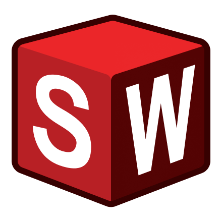
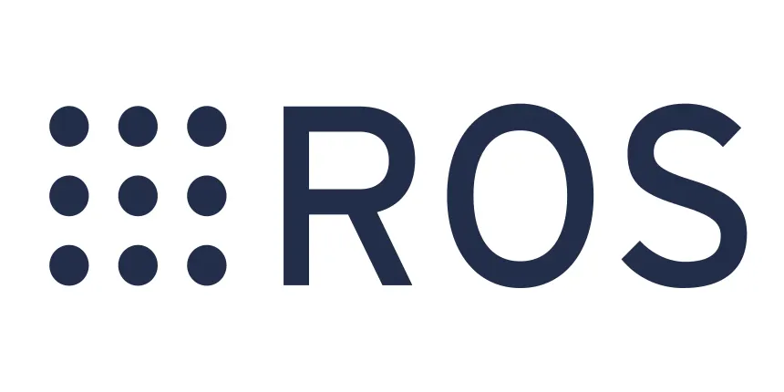
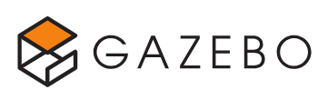

# Hi there! I am Sameer Patwardhan 🤖

---

  

---

## ⚙️ Tech Stack

---

## 🤖 Active Project

### AMR Simulation

➜

➜

➜

➜

➜

➜

Building an Autonomous Mobile Robot Simulation using ROS 2 and Gazebo Harmonic.

🔗 **Repository**  
https://github.com/sam-airobotics/amr-simulation

---

⚙️ Design → ☯️ Simulate → ✅️ Validate → 🤖 Deploy

