# Hi, I'm Sameer 🤖

---

  

---

## ⚙️ Tech Stack

### 🤖 Robotics

&nbsp;&nbsp;
&nbsp;&nbsp;
&nbsp;&nbsp;
&nbsp;&nbsp;
 
&nbsp;&nbsp;&nbsp;
&nbsp;&nbsp;
&nbsp;&nbsp;
 
&nbsp;&nbsp;
&nbsp;&nbsp;
&nbsp;&nbsp;
&nbsp;&nbsp;

### 🛠️ Tools

&nbsp;&nbsp;
&nbsp;&nbsp;
&nbsp;&nbsp;
&nbsp;&nbsp;
&nbsp;&nbsp;

### 💻 Languages

&nbsp;&nbsp;
&nbsp;&nbsp;
&nbsp;&nbsp;
&nbsp;&nbsp;
&nbsp;&nbsp;
&nbsp;&nbsp;
&nbsp;&nbsp;

---

## 🤖 Active Project

### AMR Simulation

  

 

➜

➜

➜

➜

➜

➜

Building an Autonomous Mobile Robot Simulation using ROS 2 and Gazebo Harmonic.

🔗 **Repository**  
https://github.com/sam-airobotics/amr-simulation

---

## 📱 Connect With Me

---

⚙️ Design → ☯️ Simulate → ✅️ Validate → 🤖 Deploy

---

